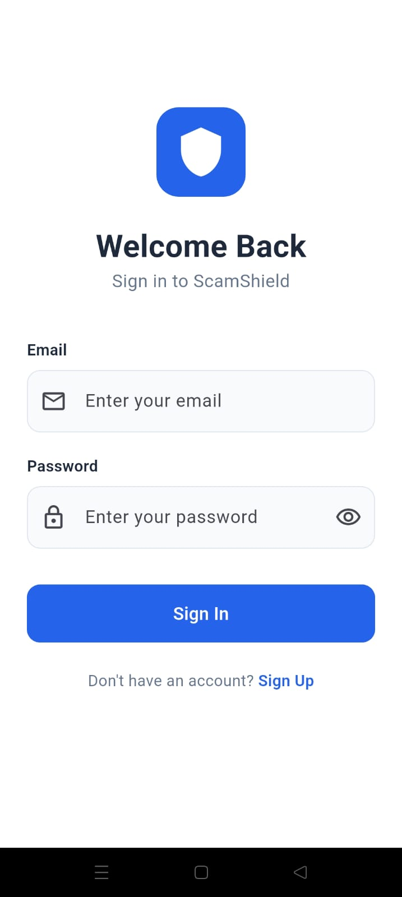
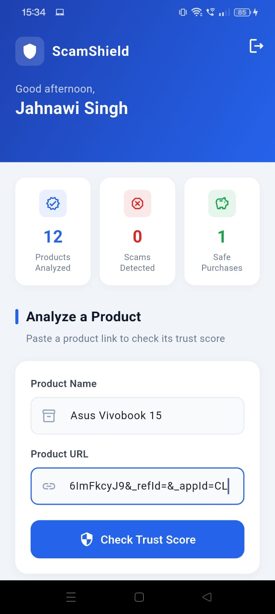
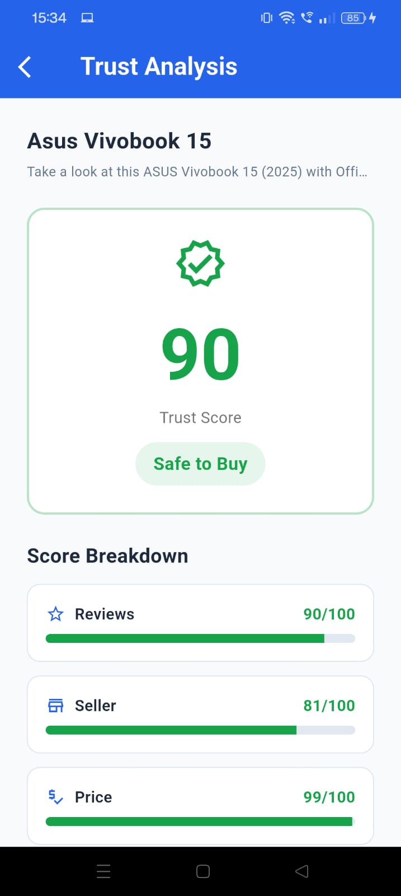

# 🛡️ ScamShield
### AI-Powered Online Purchase Trust Analyzer

> **Shop Safe. Shop Smart.** — ScamShield helps you verify whether an online product is trustworthy before you spend your money.

---

## 📱 Overview

Online shopping fraud is growing fast. Fake reviews, counterfeit products, and unreliable sellers cost consumers billions every year. Existing platforms show ratings — but they don't tell you whether those ratings are **genuine**.

**ScamShield** is a trust layer between you and the marketplace. Paste any product URL, and our AI instantly analyzes it and returns a clear trust score with actionable insights.

---

## ✨ Features

- 🔐 **Secure Authentication** — Email/password login via Firebase Auth
- 🤖 **AI Trust Analysis** — LLaMA 3.3 70B analyzes product URLs instantly
- 📊 **Trust Score** — 0–100 score with Safe / Caution / Avoid recommendation
- 🚩 **Red Flag Detection** — Specific warnings about suspicious patterns
- 📈 **Personal Stats** — Track products analyzed, scams detected, safe purchases
- 💾 **History** — Every analysis saved to your personal Firestore database
- 🎨 **Clean UI** — Material Design 3 with professional blue theme

---

## 🖼️ Screenshots
Login: 
Home:  | [alt text](image-1.png) 
Result:  | [alt text](image-3.png)

---

## 🏗️ Architecture

```
User
 │
 ▼
Flutter App (UI Layer)
 │
 ├── Firebase Auth (Authentication)
 │
 ├── Cloud Firestore (Data Storage)
 │
 └── Groq API → LLaMA 3.3 70B (AI Analysis)
```

---

## 🗂️ Project Structure

```
lib/
├── core/
│   └── constants.dart          # App constants & thresholds
├── models/
│   ├── user_model.dart         # User data model
│   └── product_model.dart      # Product analysis model
├── services/
│   ├── auth_service.dart       # Firebase Authentication
│   ├── firestore_service.dart  # Firestore CRUD operations
│   └── gemini_service.dart     # Groq AI API integration
├── providers/
│   └── auth_provider.dart      # Auth state management
└── screens/
    ├── auth/
    │   ├── login_screen.dart
    │   └── register_screen.dart
    ├── home/
    │   └── home_screen.dart
    └── dashboard/
        └── result_screen.dart
```

---

## ⚙️ Tech Stack

| Layer | Technology |
|-------|-----------|
| Frontend | Flutter 3.x (Dart) |
| Authentication | Firebase Authentication |
| Database | Cloud Firestore (NoSQL) |
| AI Model | LLaMA 3.3 70B via Groq API |
| State Management | Provider |
| Design System | Material Design 3 |

---

## 🤖 How the AI Works

1. User enters **product name** and **URL**
2. Flutter sends a structured prompt to **Groq API**
3. **LLaMA 3.3 70B** analyzes domain credibility, product patterns, and suspicious indicators
4. AI returns a structured **JSON response** with scores and explanation
5. Result is **saved to Firestore** and displayed to the user

### Trust Score Legend

| Score | Recommendation | Meaning |
|-------|---------------|---------|
| 70–100 | ✅ Safe | Trustworthy product |
| 40–69 | ⚠️ Caution | Proceed carefully |
| 0–39 | ❌ Avoid | High risk of scam |

---

## 🚀 Getting Started

### Prerequisites
- Flutter SDK 3.x
- Firebase account
- Groq API key (free at [console.groq.com](https://console.groq.com))

### Installation

**1. Clone the repository**
```bash
git clone https://github.com/YOURUSERNAME/scamshield.git
cd scamshield
```

**2. Install dependencies**
```bash
flutter pub get
```

**3. Configure Firebase**
```bash
flutterfire configure
```

**4. Add your Groq API key**

Open `lib/services/gemini_service.dart`:
```dart
final String _apiKey = 'YOUR_GROQ_API_KEY_HERE';
```

**5. Run the app**
```bash
flutter run
```

---

## 🔒 Security

- All Firestore operations require authentication
- Users can only access their own data
- Security rules enforce data isolation at database level
- API keys are never exposed in version control
- Prompt injection mitigated through structured output parsing

### Firestore Security Rules
```javascript
rules_version = '2';
service cloud.firestore {
  match /databases/{database}/documents {
    match /users/{userId} {
      allow read, write: if request.auth != null
        && request.auth.uid == userId;
    }
    match /products/{productId} {
      allow read: if request.auth != null
        && request.auth.uid == resource.data.userId;
      allow create: if request.auth != null
        && request.auth.uid == request.resource.data.userId;
      allow update, delete: if request.auth != null
        && request.auth.uid == resource.data.userId;
    }
  }
}
```

---

## 🗺️ Roadmap

- [x] MVP — Core trust analysis
- [x] Firebase Authentication
- [x] Firestore integration
- [x] AI-powered trust scoring
- [x] Personal stats dashboard
- [ ] Product history screen
- [ ] Google Sign-In
- [ ] Community scam reporting
- [ ] Browser extension
- [ ] Dark mode
- [ ] Enterprise dashboard

---

## 💡 Key Design Decisions

| Decision | Reason |
|----------|--------|
| Groq over OpenAI/Gemini | 100% free tier, no billing required, faster inference |
| Firestore over Realtime DB | Better querying, structured data, granular security rules |
| Flutter over React Native | Single codebase, better performance, excellent Firebase support |
| Provider over Bloc | Simpler state management suitable for MVP scale |
| LLaMA 3.3 70B | High quality open-source model, no training required |

---

## 👨‍💻 Developer

**Jahnawi**
- 📧 jahnawisingh14@gmail.com
- 💼 LinkedIn: [(https://www.linkedin.com/in/jahnawi-singh-795b562ba/)]
- 🐙 GitHub: [(https://github.com/jahnawi1411)]

---

## 📄 License

This project is private and not open for public distribution.  
All rights reserved © 2026 Jahnawi.

---

<p align="center">
  Built with ❤️ to make online shopping safer for everyone
</p>